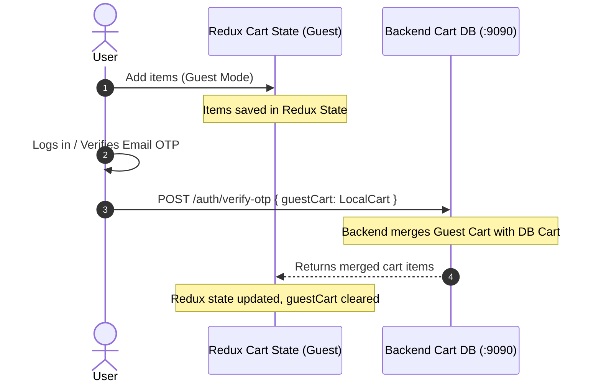

# Architecture Reference: Angels Consumer Web App

This document details the architectural design, directory layout, routing, UI system, state management, and third-party integrations for the **angels** (Consumer Portal) codebase.

---

## 1. Directory Structure

```
angels/
├── app/                      # Next.js App Router root
│   ├── (auth)/               # Route group for Login and Signup views
│   ├── addresses/            # User delivery address manager
│   ├── cart/                 # Cart review and checkout configuration page
│   ├── menu/                 # Product browsing catalog (Category tabs, product grid)
│   ├── orders/               # User order history and status tracking page
│   ├── profile/              # User profile details
│   ├── verify-otp/           # OTP screen after signup/login
│   ├── layout.tsx            # Global HTML shell injecting Redux & Theme providers
│   └── page.tsx              # Home landing page with banners, bestsellers, and hero sections
├── components/               # UI components
│   ├── 3d/                   # Three.js interactive components (CakeScene.tsx)
│   ├── common/               # General UI: header, footer, loaders
│   ├── layout/               # Shell structures (Navbar, MobileNavigation)
│   ├── sections/             # Home section layouts (Hero, Featured, CategoryList)
│   └── ui/                   # Reusable atomic elements (Buttons, Inputs, Cards)
├── features/                 # Redux Slices, RTK Query API Services, and feature logic
│   ├── auth/                 # Authentication slice (authSlice) and API (authApiService)
│   ├── cart/                 # Cart logic: cartSlice, local guest cart sync, and cartThunk
│   ├── products/             # Product selection and filters
│   └── address, order, user  # Dedicated client slices for checkout/profile flow
├── redux/                    # Redux store config
│   ├── api.ts                # Map of all RTK Query apiServices
│   ├── reducer.ts            # Dynamic Redux reducer map generation
│   └── store.ts              # Store definition
├── utils/                    # Helper constants (constants.ts) and formatters
└── local.sh                 # Environment variables and developer port settings (port: 8080)
```

---

## 2. Special Features & Visual Systems

### 3D Interactive Cakes (`components/3d/`)
- Uses **Three.js** to render interactive 3D models (like 3-tiered cakes in `CakeScene.tsx`) on the user client.
- Mounts vanilla Three.js objects (`WebGLRenderer`, `PerspectiveCamera`, `Scene`, standard lighting, and textures) inside a standard React `useEffect` hook with a container container reference (`mountRef`).
- Responsive resizing is bound to browser resize events within the hook.

### Styling & Animation
- **Material-UI (MUI)**: Custom theme variables for warm, premium bakery color palettes (pinks, creams, dark brown highlights).
- **Tailwind CSS v4**: Utility layout spacing.
- **Framer Motion & GSAP**: Scroll-triggered animations, page transitions, and card hover scaling effects.

### Address & Maps Integration
- Uses `@react-google-maps/api` to render address pins and location autocomplete.
- Integrates with the Google Maps SDK using keys declared in `local.sh` (`NEXT_PUBLIC_GOOGLE_MAPS_KEY`).

---

### Product Modal (`components/ui/ProductModal.tsx`)

- Opened from `/menu`, `/cakes`, `/cakes/[slug]`, `MenuSection` and `FeaturedSection` via `useModal().openModal(...)`.
- **`onAddToCart` is event-first — `(e: React.MouseEvent, product: Product)`** — deliberately identical to `ProductCard`'s prop, because every page hands the same `handleAddToCart` to both and those handlers call `e.stopPropagation()`. A single-argument signature here silently breaks Add to Cart at every call site.
- Callers pass **no `title`** (the modal renders the product name itself) and `disableContentPadding: true` so the image panel runs edge-to-edge. `ModalProvider` renders its title bar only when a title is supplied, and floats a close button over the content otherwise.
- The image is locked to 1:1 with an aspect-ratio box, matching `IMAGE_SLOTS.productGallery`.
- The layout grid uses `minmax(0, 1fr)` tracks with `minWidth: 0` on both columns — a bare `1fr` cannot shrink below the thumbnail strip's min-content width and overflows narrow dialogs.

### Order Status Vocabulary

- `utils/orderStatus.ts` mirrors the Prisma `OrderStatus` enum and backs both `/orders` and `/orders/[id]`. `aimk_admin/utils/orderStatus.ts` is a byte-identical copy — **change both together**.

## 3. Cart Sync & Checkout Flow



- **Authentication / OTP**: User inputs phone/email, Twilio triggers OTP in backend, user redirects to `/verify-otp`.
- **Cart Sync**: Local/Guest cart is kept in Redux (`cartSlice.ts`). Upon successful OTP verification, the guest cart is sent as a payload in `verifyOtp` mutation to merge it on the server database.
- **Razorpay Payments**:
  - The Checkout interface interacts with Razorpay SDK (`window.Razorpay` script loaded dynamically).
  - Razorpay order ID is fetched from `/order/create` (backend), payment overlay displays, and callback calls `/payment/verify` to confirm.

---

## 4. Authentication & Security Flow (Passwordless & RTR)

### Unified Passwordless Experience
- Customers authenticate completely passwordlessly on both the `LoginModal` and the `/login` page using:
  - **Email OTP**: Requests verification OTP via `/auth/request-otp`, verifies OTP via `/auth/verify-email-otp` to get an `emailVerificationToken`, and completes login/registration via passwordless endpoints.
  - **Phone OTP**: Handled via the MSG91 OTP widget, verifying the number on the client and resolving with an access token verified by the backend.
  - **Google OAuth**: Verifies the Google ID Token. If the account doesn't have a verified phone, the app prompts for phone verification.
- User profile completion (First & Last name entry) is requested only on registration (`NEW_USER`).

### Session Lifespans & Automatic Refresh
- **Access Token**: Valid for `15m`, saved securely in LocalStorage using AES-GCM encryption (`helpers/encryptToken.helper.ts`).
- **Refresh Token**: Stored as a high-entropy string in LocalStorage.
- **Automatic RTR**: All RTK Query API slices (`authApiService`, `userApiService`, etc.) use a unified `baseQueryWithReauth` wrapper. When a query fails with `401 Unauthorized` (indicating access token expiry), it automatically fires a POST request to `/auth/refresh` using the `refreshToken`, rotates both tokens in storage, updates the Redux store, and transparently retries the failed request.

